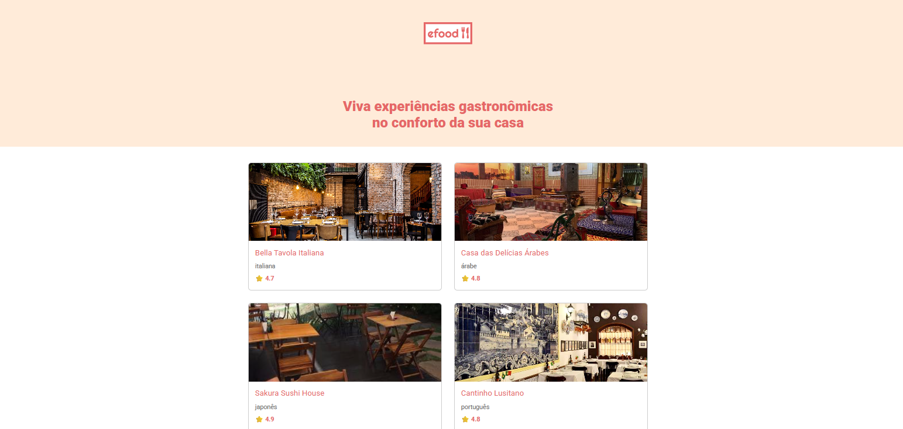
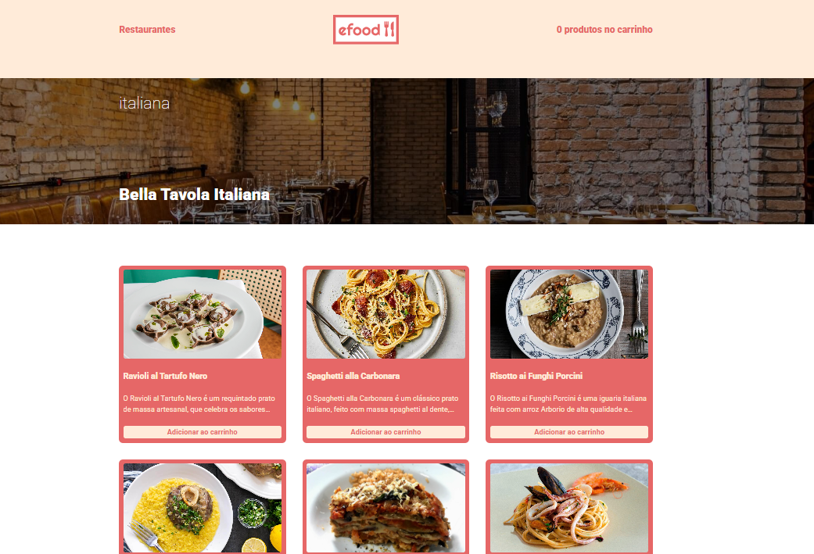
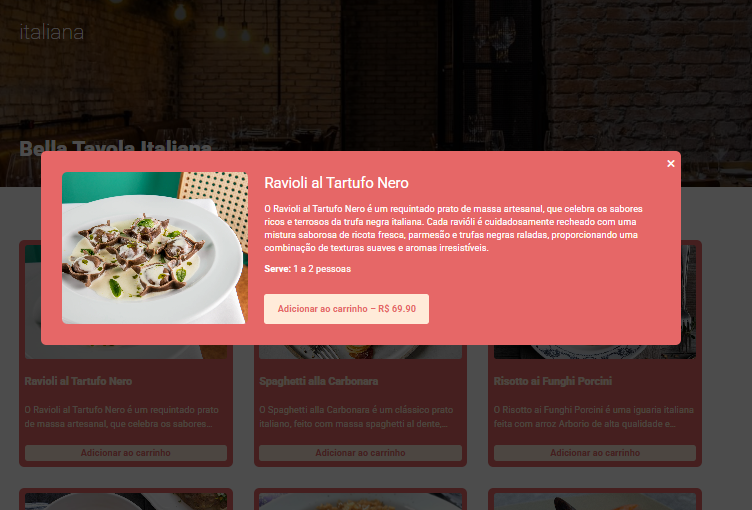

# 🍽️ eFood

Aplicativo fictício de delivery de comida desenvolvido como projeto do curso de Front-End da EBAC. O objetivo é aplicar na prática conceitos de **React**, **Styled Components**, **consumo de API**, **roteamento** e **componentização**.

---

## 🚀 Tecnologias utilizadas

- React
- TypeScript
- React Router DOM
- Styled Components
- Vite ou Create React App (dependendo da base)
- [Fake API - eFood](https://fake-api-tau.vercel.app/api/efood/restaurantes)

## 📸 Prévia

### 🏠 Página Inicial

### 🍝 Página do Restaurante

### 🧾 Modal de Produto

## 📂 Estrutura do projeto
src/
├── assets/ # Imagens e logos
├── components/ # Componentes reutilizáveis (botões, modal, tags etc)
├── container/ # Componentes maiores (header, footer, hero etc)
├── pages/ # Páginas (Home e Restaurants)
├── styles/ # Estilo global e variáveis
├── routes.tsx # Definição de rotas
├── App.tsx # Componente raiz da aplicação
└── main.tsx # Ponto de entrada do React

## 💻 Como rodar o projeto localmente

1. Clone o repositório:
git clone https://github.com/josezaltar/EBAC-EFood.git

2. Acesse a pasta:
cd efood

3. Instale as dependências:
npm install

4. Inicie o servidor de desenvolvimento:
npm run dev

5. Acesse no navegador:
http://localhost:3000

## 🔗 API utilizada
Os dados de restaurantes e cardápios são carregados via AJAX da API pública abaixo:

https://fake-api-tau.vercel.app/api/efood/restaurantes

## ✨ Funcionalidades
✅ Página inicial com listagem de restaurantes

✅ Página individual de restaurante com pratos

✅ Modal de produto com nome, descrição, porção e preço

✅ Botão "Adicionar ao carrinho" (em breve com integração real)

✅ Estilo responsivo e 100% modular com Styled Components

✅ Navegação entre páginas com React Router

##  🧠 Aprendizados
Este projeto reforçou os seguintes conceitos:

Componentização e reutilização de código com React

Boas práticas com Styled Components

Separação de responsabilidades por pastas

Roteamento entre páginas com React Router

Consumo de API com fetch e useEffect

Uso de props, tipagem com TypeScript e modularização

## 📬 Contato
José Zaltar
📧 josezaltar@gmail.com.com
🔗 linkedin.com/in/josezaltar/

